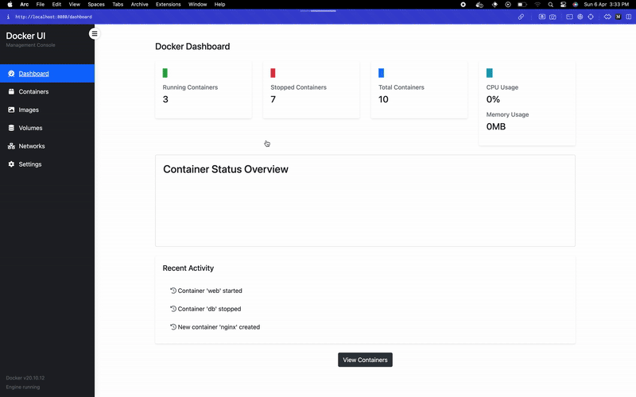

I wanted to turn an old PC into a personal dev server — perfect for Docker. But Docker Desktop was too heavy, and eats more RAM than the actual containers. I don’t want to SSH every time or memorize CLI commands either.

So this is pretty much: a light web-based UI for managing Docker — containers, images, volumes, networks (hopefully) — all through a simple dashboard.

Doesn’t require any special setup, just needs the docker engine. Basically, if you can run `docker ps` in your terminal, you can run this.

